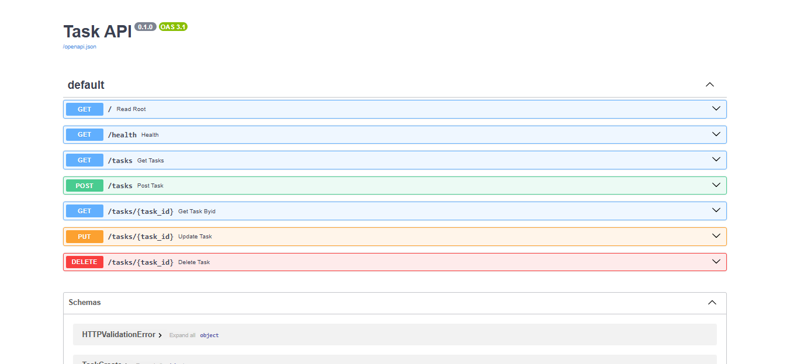
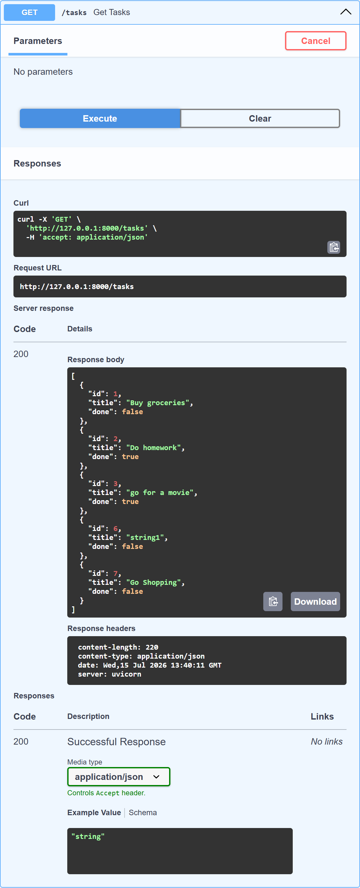
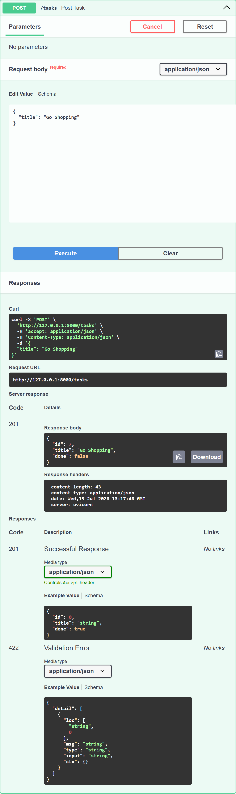

# Task API

A simple FastAPI-based task management API with CRUD endpoints for tasks.

## Introduction

FastAPI is a powerful and beginner-friendly Python framework for building APIs. It helps you create web services with very little code while still offering automatic validation, clear documentation, and fast performance. If you are new to APIs, think of FastAPI as a tool that lets your application communicate with other apps or websites using simple HTTP requests.

In this project, we use FastAPI to build a small task management API. A task is a simple item such as "buy groceries" or "do homework". Through this API, you can create tasks, view all tasks, view one task by ID, update a task, or delete a task.

Each API endpoint is a unique URL that performs one action. For example, `/tasks` can be used to get or create tasks, while `/tasks/{task_id}` can be used to view, update, or delete a specific task. FastAPI also generates a built-in Swagger documentation page at `/docs`, which lets you explore the API in your browser and try requests directly.

### Features

- Create new tasks
- Retrieve all tasks or a single task by ID
- Update an existing task
- Delete a task
- Built-in health check endpoint
- Interactive API docs at `/docs`

---

## Project Structure

```text
main.py
routes.py
schemas.py
README.md
```

- `main.py` contains the FastAPI app instance and root/health endpoints.
- `routes.py` defines all task-related API routes.
- `schemas.py` contains request and response models using Pydantic.

---

## API Endpoints

### 1. Root endpoint

- Method: `GET`
- Path: `/`
- Description: Returns basic API information.

Example response:

```json
{
  "name": "Task API",
  "version": "1.0",
  "endpoints": ["/tasks"]
}
```

### 2. Health check

- Method: `GET`
- Path: `/health`
- Description: Confirms that the service is running.

Example response:

```json
{
  "status": "ok"
}
```

### 3. Get all tasks

- Method: `GET`
- Path: `/tasks`
- Description: Returns the full list of tasks.

Example response:

```json
[
  {
    "id": 1,
    "title": "Buy groceries",
    "done": false
  },
  {
    "id": 2,
    "title": "Do homework",
    "done": true
  }
]
```

### 4. Get a single task by ID

- Method: `GET`
- Path: `/tasks/{task_id}`
- Description: Returns the task matching the provided ID.

Example:

```http
GET /tasks/1
```

Example response:

```json
{
  "id": 1,
  "title": "Buy groceries",
  "done": false
}
```

If the task does not exist, the API returns a `404` error.

### 5. Create a new task

- Method: `POST`
- Path: `/tasks`
- Description: Creates a new task.
- Status code: `201 Created`

Request body:

```json
{
  "title": "Learn FastAPI"
}
```

Example response:

```json
{
  "id": 6,
  "title": "Learn FastAPI",
  "done": false
}
```

### 6. Update a task

- Method: `PUT`
- Path: `/tasks/{task_id}`
- Description: Updates the title and/or completion status of a task.

Request body example:

```json
{
  "title": "Learn FastAPI thoroughly",
  "done": true
}
```

You can also send only one field if needed:

```json
{
  "done": true
}
```

Example response:

```json
{
  "id": 1,
  "title": "Learn FastAPI thoroughly",
  "done": true
}
```

### 7. Delete a task

- Method: `DELETE`
- Path: `/tasks/{task_id}`
- Description: Deletes a task by ID.
- Status code: `204 No Content`

Example:

```http
DELETE /tasks/1
```

If the task does not exist, the API returns a `404` error.

---

## Example Requests

### Using curl

Get all tasks:

```bash
curl http://127.0.0.1:8000/tasks
```

Create a task:

```bash
curl -X POST "http://127.0.0.1:8000/tasks" \
  -H "Content-Type: application/json" \
  -d '{"title":"Learn FastAPI"}'
```

Update a task:

```bash
curl -X PUT "http://127.0.0.1:8000/tasks/1" \
  -H "Content-Type: application/json" \
  -d '{"done":true}'
```

Delete a task:

```bash
curl -X DELETE "http://127.0.0.1:8000/tasks/1"
```

---

## How to Run

### Prerequisites

- Python 3.8+
- FastAPI
- Uvicorn

### Install dependencies

If you are using the virtual environment already created in this workspace, activate it:

```powershell
.\venv\Scripts\Activate.ps1
```

Install the FastAPI package with the standard extras:

```bash
pip install "fastapi[standard]"
```

You can also run the app in development mode with:

```bash
fastapi dev main.py
```

### Start the server

From the project root, you can also start it with:

```bash
uvicorn main:app --reload
```

The API will be available at:

- http://127.0.0.1:8000
- Swagger UI: http://127.0.0.1:8000/docs
- ReDoc: http://127.0.0.1:8000/redoc

---

## Screenshots


```md



```
---

## Notes

- The app uses an in-memory list for demo purposes, so data will reset when the server restarts.
- For production use, you would typically connect this API to a database.

---

## Star This Project

If you found this project useful, please show your support by starring the repository on GitHub.

⭐ Star this repo if you like it!
