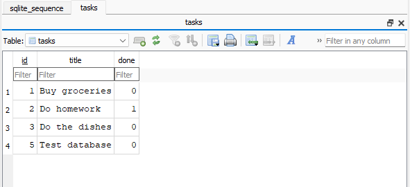

# Task API

A simple FastAPI-based task management API with CRUD endpoints for tasks, SQLite database storage, and SQL-based search, filtering, and statistics.

## Introduction

FastAPI is a Python framework used to build APIs quickly and easily. It is beginner-friendly and helps you create web services with less code. It also gives you automatic validation and built-in documentation, which makes testing your API easier.

This project is a small task management API. You can use it to create tasks, view all tasks, view one task by ID, update a task, or delete a task. Think of it as a simple backend that stores tasks and lets other apps interact with them.

The project initially used an in-memory list for storing tasks. It has now been connected to a SQLite database so that task data persists even after the server is restarted.

An API endpoint is simply a web address that performs a specific action. For example, `/tasks` is used to view or create tasks, and `/tasks/{task_id}` is used to work with one specific task. FastAPI also gives you a Swagger page at `/docs`, where you can see all endpoints and try them in your browser.

### Features

- Create new tasks
- Retrieve all tasks or a single task by ID
- Update an existing task
- Delete a task
- Search tasks by title using SQL
- Filter tasks by completion status using SQL
- View task statistics using SQL
- Persistent SQLite database storage
- Built-in health check endpoint
- Interactive API docs at `/docs`

---

## Project Structure

```text
main.py
routes.py
schemas.py
database.py
tasks.db
README.md
screenshots/
```

- `main.py` contains the FastAPI app instance and root/health endpoints.
- `routes.py` defines all task-related API routes and database operations.
- `schemas.py` contains request and response models using Pydantic.
- `database.py` contains the SQLite database connection and initialization logic.
- `tasks.db` is the SQLite database file created automatically when the application starts.
- `README.md` contains the project documentation.
- `screenshots/` contains screenshots used in this README.

---

## Database

The application uses **SQLite** to store tasks instead of an in-memory Python list.

SQLite was chosen because it is lightweight, does not require a separate database server, and is suitable for a small FastAPI application.

The database file is:

```text
tasks.db
```

It is stored in the project root and is created automatically when the application starts.

### Tasks Table

The `tasks` table contains the following fields:

| Field | Type | Description |
|---|---|---|
| `id` | INTEGER | Primary key generated by SQLite |
| `title` | TEXT | Task title |
| `done` | INTEGER | Completion status (`0` = false, `1` = true) |

The table is created automatically if it does not already exist.

Three sample tasks are inserted only when the table is empty. This prevents duplicate sample tasks when the server is restarted.

The `tasks.db` file is ignored by Git, so the local database is not committed to the repository.

---

## API Endpoints

### 1. Root endpoint

- Method: `GET`
- Path: `/`
- Description: Returns basic API information.

Example response:

```json
{
  "name": "Task API",
  "version": "1.0",
  "endpoints": ["/tasks"]
}
```

### 2. Health check

- Method: `GET`
- Path: `/health`
- Description: Confirms that the service is running.

Example response:

```json
{
  "status": "ok"
}
```

### 3. Get all tasks

- Method: `GET`
- Path: `/tasks`
- Description: Returns the full list of tasks from the SQLite database.

Example response:

```json
[
  {
    "id": 1,
    "title": "Buy groceries",
    "done": false
  },
  {
    "id": 2,
    "title": "Do homework",
    "done": true
  }
]
```

### 4. Get a single task by ID

- Method: `GET`
- Path: `/tasks/{task_id}`
- Description: Returns the task matching the provided ID.

Example:

```http
GET /tasks/1
```

Example response:

```json
{
  "id": 1,
  "title": "Buy groceries",
  "done": false
}
```

If the task does not exist, the API returns a `404` error.

### 5. Create a new task

- Method: `POST`
- Path: `/tasks`
- Description: Creates a new task and stores it in the SQLite database.
- Status code: `201 Created`

Request body:

```json
{
  "title": "Learn FastAPI"
}
```

Example response:

```json
{
  "id": 6,
  "title": "Learn FastAPI",
  "done": false
}
```

### 6. Update a task

- Method: `PUT`
- Path: `/tasks/{task_id}`
- Description: Updates the title and/or completion status of a task.

Request body example:

```json
{
  "title": "Learn FastAPI thoroughly",
  "done": true
}
```

You can also send only one field if needed:

```json
{
  "done": true
}
```

Example response:

```json
{
  "id": 1,
  "title": "Learn FastAPI thoroughly",
  "done": true
}
```

### 7. Delete a task

- Method: `DELETE`
- Path: `/tasks/{task_id}`
- Description: Deletes a task by ID from the SQLite database.
- Status code: `204 No Content`

Example:

```http
DELETE /tasks/1
```

If the task does not exist, the API returns a `404` error.

---

## SQL-Based Extras

The database is also used to perform searching, filtering, and statistics directly through SQL rather than processing all tasks in Python.

### Search tasks

Tasks can be searched by title using SQL's `LIKE` operator.

Example:

```http
GET /tasks?search=milk
```

The filtering is performed in SQL using a condition similar to:

```sql
WHERE title LIKE ?
```

### Filter by status

Tasks can be filtered according to their completion status.

Completed tasks:

```http
GET /tasks?done=true
```

Incomplete tasks:

```http
GET /tasks?done=false
```

The filtering is performed using a SQL `WHERE` condition.

### Task statistics

The API provides task statistics calculated directly using SQL.

- Method: `GET`
- Path: `/stats`

Example:

```http
GET /stats
```

Example response:

```json
{
  "total": 3,
  "done": 1,
  "open": 2
}
```

The total task count is calculated using SQL's `COUNT(*)` rather than counting the tasks in Python.

---

## Example Requests

### Using curl

Get all tasks:

```bash
curl http://127.0.0.1:8000/tasks
```

Create a task:

```bash
curl -X POST "http://127.0.0.1:8000/tasks" \
  -H "Content-Type: application/json" \
  -d '{"title":"Learn FastAPI"}'
```

Update a task:

```bash
curl -X PUT "http://127.0.0.1:8000/tasks/1" \
  -H "Content-Type: application/json" \
  -d '{"done":true}'
```

Delete a task:

```bash
curl -X DELETE "http://127.0.0.1:8000/tasks/1"
```

Search tasks:

```bash
curl "http://127.0.0.1:8000/tasks?search=milk"
```

Filter completed tasks:

```bash
curl "http://127.0.0.1:8000/tasks?done=true"
```

Get statistics:

```bash
curl http://127.0.0.1:8000/stats
```

---

## How to Run

### Prerequisites

- Python 3.8+
- FastAPI
- Uvicorn

### Install dependencies

If you are using the virtual environment already created in this workspace, activate it:

```powershell
.\venv\Scripts\Activate.ps1
```

Install the FastAPI package with the standard extras:

```bash
pip install "fastapi[standard]"
```

You can also run the app in development mode with:

```bash
fastapi dev main.py
```

### Start the server

From the project root, you can also start it with:

```bash
uvicorn main:app --reload
```

The API will be available at:

- http://127.0.0.1:8000
- Swagger UI: http://127.0.0.1:8000/docs
- ReDoc: http://127.0.0.1:8000/redoc

When the application starts, `tasks.db` is created automatically if it does not already exist.

---

## SQLite Database Operations

The SQLite database can be opened and inspected using **DB Browser for SQLite**.

### View all tasks

```sql
SELECT * FROM tasks;
```

### View completed tasks

```sql
SELECT * FROM tasks
WHERE done = 1;
```

### Count all tasks

```sql
SELECT COUNT(*) FROM tasks;
```

### Update tasks

```sql
UPDATE tasks
SET done = 1;
```

### Delete completed tasks

```sql
DELETE FROM tasks
WHERE done = 1;
```

These SQL queries were also used to verify that changes made directly in the database are reflected by the FastAPI application.

---

## Screenshots

### Swagger UI


### GET /tasks Response


### POST /tasks Request


### SQLite Database



The SQLite screenshot shows the `tasks` table in DB Browser for SQLite with the stored task data.

---

## Notes

- The application uses SQLite for persistent task storage.
- The database file is `tasks.db` in the project root.
- The database and `tasks` table are created automatically when the application starts.
- Three sample tasks are inserted only when the table is empty.
- Tasks created through the API persist after restarting the FastAPI server.
- The database can be inspected and modified directly using DB Browser for SQLite.
- `tasks.db` is ignored by Git because each local project copy maintains its own database.
- Search, status filtering, and statistics are handled using SQL queries.
- User-provided values are passed to SQL using parameterized queries.

---

## Star This Project

If you found this project useful, please show your support by starring the repository on GitHub.

⭐ Star this repo if you like it!